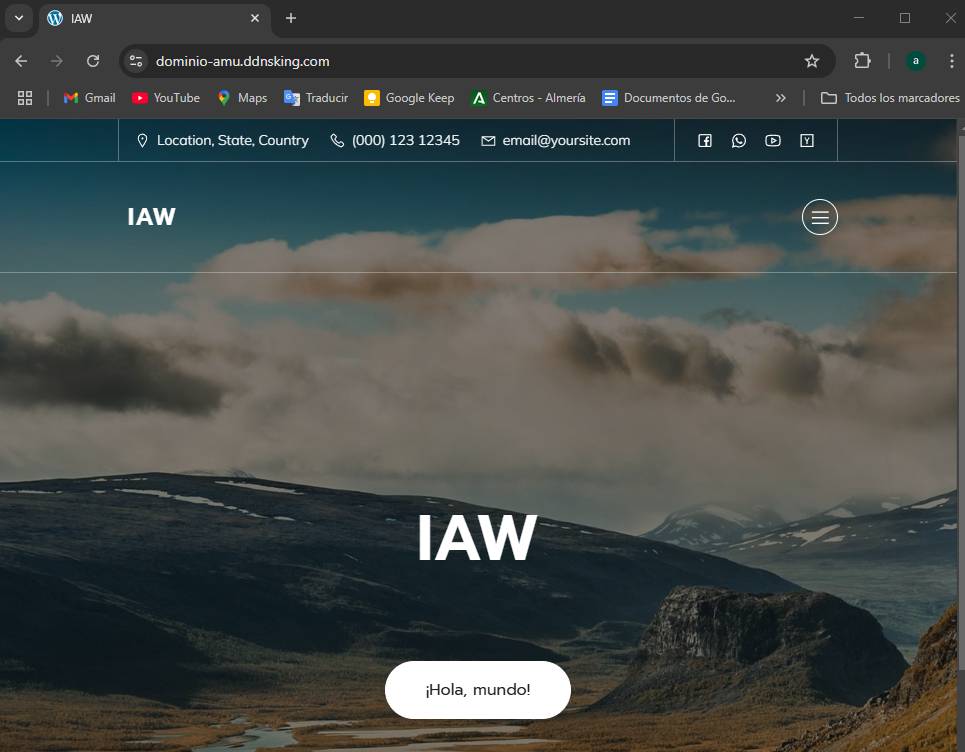
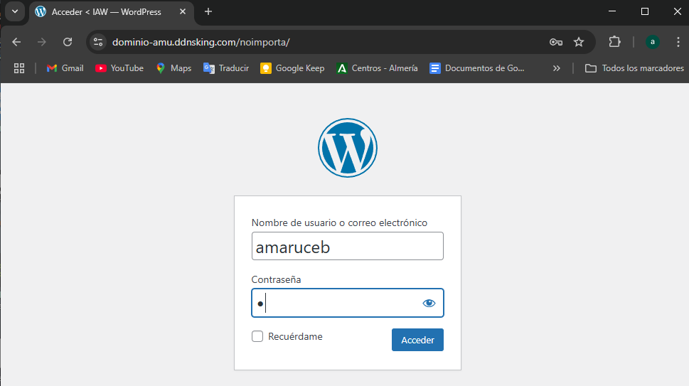

# Práctica 3.1. Implantación de WordPress en Amazon Web Services (AWS) mediante Ansible

## Playbook para configurar HTTPS

Este **playbook** de **Ansible** configura **HTTPS** en el servidor **frontend** de una aplicación. A continuación, se resumen las tareas:

1.  **Desinstalar Certbot anterior:**
    
    -   Utiliza `apt` para eliminar versiones anteriores de **Certbot**.
2.  **Instalar Certbot con snap:**
    
    -   Utiliza `snap` para instalar **Certbot** en modo clásico.
3.  **Configurar certificado SSL/TLS con Let's Encrypt:**
    
    -   Usa `command` para ejecutar **Certbot** y obtener un certificado **SSL/TLS.**
    -   Parámetros dinámicos: correo (`{{ certificate_email }}`), dominio (`{{ certificate_domain }}`).
    -   Configura automáticamente **Apache** con el certificado (`--apache`).

## Playbook para el Deploy de WordPress

Este **playbook** de **Ansible** facilita el deploy de la aplicación web **WordPress** en el servidor **frontend**. A continuación, se describen las tareas realizadas:

1.  **Eliminar archivo wp-cli.phar anterior:**
    
    -   Utiliza el módulo `file` para eliminar cualquier versión previa de **wp-cli.phar** en el directorio temporal `/tmp`.
2.  **Descargar wp-cli.phar:**
    
    -   Utiliza el módulo `get_url` para descargar wp-cli.phar desde **GitHub** y almacenarlo en `/tmp` con permisos adecuados.
3.  **Mover wp-cli.phar a /usr/local/bin/wp:**
    
    -   Utiliza el comando `command` para mover wp-cli.phar a `/usr/local/bin/wp`.
4.  **Borrar contenido de /var/www/html:**
    
    -   Utiliza el módulo `file` para eliminar el contenido existente en el directorio `/var/www/html`.
5.  **Descargar WordPress core:**
    
    -   Utiliza el comando `shell` para descargar el núcleo de **WordPress** con configuración regional en español (`es_ES`) en el directorio `/var/www/html`.
6.  **Crear wp-config.php:**
    
    -   Utiliza el comando `command` para crear el archivo **wp-config.php** con las variables definidas en `variables.yml`.
7.  **Instalar WordPress:**
    
    -   Utiliza el comando `command` para instalar **WordPress** con configuración específica, incluyendo la URL, título, usuario administrador y más.
8.  **Copiar .htaccess:**
    
    -   Utiliza el módulo `copy` para copiar el archivo *.htaccess* desde el directorio `../htaccess/` al directorio `/var/www/html/`.
9.  **Eliminar wp-config.php existente:**
    
    -   Utiliza el módulo `file` para eliminar cualquier versión existente de **wp-config.php** en `/var/www/html/`.
10.  **Instalar y activar el plugin "wps-hide-login":**

- Utiliza el comando `cmd` para instalar y activar el plugin "**wps-hide-login**".

11.  **Establecer la estructura de PermaLinks:**

- Utiliza el comando `cmd` para configurar la estructura de **PermaLinks** en **WordPress**.

12.  **Actualizar reglas de reescritura de URL:**

- Utiliza el comando `cmd` para actualizar las reglas de reescritura de URL en **WordPress**.

13.  **Cambiar el propietario a www-data:**

- Utiliza el módulo `file` con `become_user` para cambiar el dueño del directorio `/var/www/html/` a `www-data`.

  

## Playbook para instalar la pila LAMP en el Backend

  

Este **playbook** de **Ansible** automatiza la instalación de la pila **LAMP** (**Linux, Apache, MySQL, Python**) en el servidor backend. A continuación, se describen las tareas llevadas a cabo:

1.  **Actualizar los repositorios:**
    
    -   Utiliza el módulo `apt` para actualizar los repositorios del sistema.
2.  **Instalar MySQL Server:**
    
    -   Utiliza `apt` para instalar el sistema gestor de bases de datos **MySQL** (`mysql-server`).
3.  **Instalar pip3 y el módulo pymysql:**
    
    -   Utiliza `apt` para instalar el gestor de paquetes de **Python** (`python3-pip`).
    -   Utiliza `pip` para instalar el módulo de **Python** pymysql.
4.  **Crear una base de datos:**
    
    -   Utiliza el módulo `mysql_db` para crear la base de datos definida en `variables.yml`.
5.  **Crear el usuario de la base de datos:**
    
    -   Utiliza el módulo `mysql_user` para crear un usuario de **MySQL** con privilegios específicos en la base de datos.
6.  **Configurar MySQL para permitir conexiones desde cualquier interfaz:**
    
    -   Utiliza el módulo `replace` para modificar la configuración de **MySQL** y permitir conexiones desde cualquier interfaz.
7.  **Reiniciar el servicio de base de datos:**
    
    -   Utiliza el módulo `service` para reiniciar el servicio **MySQL** después de realizar las configuraciones.

## Playbook para instalar la pila LAMP en el FrontEnd

Este **playbook** de **Ansible** automatiza la instalación de la pila **LAMP** (**Linux, Apache, MySQL, PHP**) en el servidor frontend. A continuación, se describen las tareas llevadas a cabo:

1.  **Actualizar los repositorios:**
    
    -   Utiliza el módulo `apt` para actualizar los repositorios del sistema.
2.  **Instalar Apache:**
    
    -   Utiliza `apt` para instalar el servidor web **Apache** (`apache2`).
3.  **Instalar PHP y módulos necesarios:**
    
    -   Utiliza `apt` para instalar **PHP** y diversos módulos necesarios para el funcionamiento de aplicaciones web, incluyendo soporte para **MySQL**, manipulación de imágenes, internacionalización, entre otros.
4.  **Modificar valores de configuración de PHP:**
    
    -   Utiliza el módulo `replace` para ajustar varios parámetros de configuración en el archivo `php.ini`, incluyendo `max_input_vars`, `memory_limit`, `post_max_size`, y `upload_max_filesize`.
5.  **Copiar archivo de configuración de Apache:**
    
    -   Utiliza el módulo `copy` para copiar un archivo de configuración personalizado de **Apache** desde la ruta `../templates/000-default.conf` al directorio `/etc/apache2/sites-available/`.
6.  **Habilitar el módulo rewrite de Apache:**
    
    -   Utiliza el módulo `apache2_module` para habilitar el módulo `rewrite` en **Apache**.
7.  **Reiniciar el servidor web Apache:**
    
    -   Utiliza el módulo `service` para reiniciar el servicio **Apache** después de realizar las configuraciones.

## Playbook para instalar herramientas adicionales

Este **playbook** de **Ansible** se encarga de instalar herramientas adicionales en el servidor frontend, incluyendo **phpMyAdmin**. A continuación, se describen las tareas realizadas:

1.  **Descargar phpMyAdmin:**
    
    -   Utiliza el módulo `get_url` para descargar **phpMyAdmin** versión 5.2.0 en formato ZIP desde el sitio oficial.
2.  **Instalar unzip:**
    
    -   Utiliza `apt` para instalar la herramienta `unzip` necesaria para descomprimir archivos ZIP.
3.  **Descomprimir phpMyAdmin:**
    
    -   Utiliza el módulo `unarchive` para descomprimir el archivo ZIP descargado en el directorio temporal `/tmp/`.
4.  **Copiar phpMyAdmin:**
    
    -   Utiliza el módulo `copy` para copiar el contenido de la carpeta descomprimida de **phpMyAdmin** a `/var/www/html/phpmyadmin/`.
5.  **Cambiar propietario y grupo de phpMyAdmin:**
    
    -   Utiliza el módulo `file` para cambiar el propietario y el grupo del directorio de **phpMyAdmin** a `www-data`, asegurando permisos adecuados.
6.  **Instalar pip3 y PyMySQL:**
    
    -   Utiliza `apt` para instalar `python3-pip`.
    -   Utiliza `pip` para instalar el módulo PyMySQL necesario para interactuar con **MySQL** desde **Python**.
7.  **Crear base de datos para phpMyAdmin:**
    
    -   Utiliza el módulo `mysql_db` para crear la base de datos requerida para **phpMyAdmin**.
8.  **Importar la base de datos de phpMyAdmin:**
    
    -   Utiliza el módulo `mysql_db` para importar la estructura de la base de datos desde el archivo `create_tables.sql` proporcionado por phpMyAdmin.
9.  **Crear usuario de phpMyAdmin:**
    
    -   Utiliza el módulo `mysql_user` para crear un usuario dedicado a **phpMyAdmin** con privilegios en la base de datos recién creada.

## VARIABLES.YML

Estas son las **variables** que he utilizado

1. **certbot:** 
  
    - domain: "dominio-amu.ddnsking.com"
    
    - email: "amaruceb@iescelia.org"

2. **wordpress:**
  
    - directory: "/var/www/html"
  
    - user: "user"
  
    - pass: "a"
  
    - titulo: "IAW"
  
    - hide_login_url: "noimporta"

3. **db:**
    - name: "wp_amu"
    - user: "amaruceb"
    - password: "a"

4. **mysql:**
  
    - backend_private_ip: "172.31.6.116"
  
    - frontend1_private_ip: "172.31.15.194"
    - frontend2_private_ip: "172.31.7.63"

5. **loadbalancer:**
    - ip_fronted_1: "172.31.15.194"
    - ip_fronted_2: "172.31.7.63"

6. **nfs:**
  
    - frontend_network: "172.31.0.0/16"
  
    - nfs_server_ip: "172.31.5.24"

## Wordpress
### Pagina

### Hide login

### No-ip
